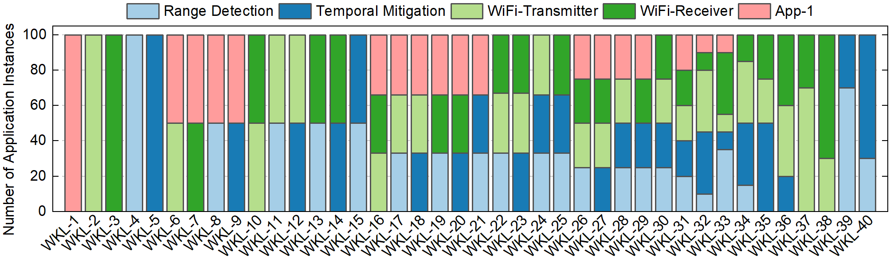

*************************************************************************
   	© Copyright 2021 ASU All rights reserved.
      This file contains confidential and proprietary
 	    information of DASH-SoC Project.
*************************************************************************
# 1. Installation Guide :

In order to install required software, please refer to Installation_guide.txt file.

# 2. How to run the program?

Create a configuration file which contains file names for DASH-SoC resources (SoC.\*.txt) and tasks (job_\*.txt)
and scheduler name (e.g., min_execution_time). Please refer to config_file.ini file for more information about the format.

## 2.1 Job File (config_Jobs folder)
Create a Task list in a text file (job_*.txt) using the key word add_new_tasks followed by the task list.
```
The format: add_new_tasks $num_of_tasks (int)
            $task_name (string) $task_id (int) $task_predecessors (list)
```

Example: The following lines add a new task with ID=0, and predecessor for this task is task with ID=2
(empty list means there is no dependency) 
```
add_new_tasks 1
scrambler 0 2
```

## 2.2 SoC Configuration File (config_SoC folder)
Create a Resource list in a text file (SoC.*.txt) using the key word add_new_resource followed by the resource.
```
The format: add_new_resource $resource_type (string)  $resource_name (string) $resource_id (int) $capacity (int) $num_of_supported_functionality (int) $DVFS_mode (string)
    $functionality_name (string) $execution_time (float)
        opp $frequency (int - MHz) $voltage (int - mV), defines the Operating Performance Points (OPPs) with frequency and voltage tuples
        trip_freq $trip_1 $trip_2 $trip_3 ..., defines the frequencies that are set at each trip point if throttling is enabled. "-1" means that the frequency is not modified
        power_profile $frequency $power_1 $power_2 $power_3 ... $power_max_capacity
        PG_profile $frequency $power_1 $power_2 $power_3 ... $power_max_capacity
```

Example: The following lines add a new CPU with name=P1, ID=0, capacity=1 and that can run 3 different tasks using "performance" DVFS mode
```
add_new_resource resource_type CPU resource_name P1 resource_ID 0 capacity 1 num_supported_functionalities 3 DVFS_mode performance
opp 1000 1150
trip_freq -1 -1 -1
power_profile 1000 0.1
PG_profile 1000 0.1
scrambler 12
reed_solomon_encoder 15
bpsk_modulation 18
```

## 2.3 Simulator Configuration File
Adjust the configurations in config_file.ini as needed.

## 2.4 Running the Simulator
Finally, run DASH_Sim_v0.py to start the simulation.
Please be sure that all the files listed below are in your file directory

# 3. File Structure
```
├── DASH_Sim_v0.py               : This file is the main() function which should be run to get the simulation results.
│   ├── clusters.py              : This file contains the information about the clusters in the SoC.
│   ├── common.py                : This file contains all the common parameters used in DASH_Sim.
│   ├── config_file.ini          : This file contains all the file names and variables to initialize the DASH_Sim
│   ├── CP_models.ini            : This file contains the code for dynamic scheduling with Constraint Programming.
│   ├── DASH_Sim_core.py         : This file contains the simulation core that handles the simulation events.
│   ├── DASH_Sim_utils.py        : This file contains functions that are used by DASH_Sim.
│   ├── DASH_SoC_parser.py       : This file contains the code to parse DASH-SoC given in config_file.ini file.
│   ├── DTPM.py                  : This file contains the code for the DTPM module.
│   ├── DTPM_policies.py         : This file contains the DVFS policies.
│   ├── DTPM_power_models.py     : This file contains functions that are used by the DVFS mechanism and PEs to get performance, power, and thermal values.
│   ├── job_generator.py         : This file contains the code for the job generator.
│   ├── job_parser.py            : This file contains the code to parse jobs given in config_file.ini file.
│   ├── processing_element.py    : This file contains the process elements and their attributes.
│   ├── scheduler.py             : This file contains the code for scheduler class which contains different types of scheduler.
│   ├── config_SoC/SoC.*.txt     : These files are the configuration files of the Resources available in DASH-SoC.
│   └── config_Jobs/job_*.txt    : These files are the configuration files of the Jobs.
└── ...
```

# 4. Dynamic Adaptive Scheduling Framework (DAS)
Dynamic Adaptive Scheduling (DAS) Framework aims to choose between a fast, simple, and low-overhead scheduler and a slow, complex, high-quality scheduler at run-time using the decisions given by the DAS preselection classifier. DAS framework is evaluated using five real-world applications, namely, range detection, WiFi transmitter, WiFi receiver, pulse doppler applications, and a proprietary industrial application (App-1). DAS preselection classifier is trained using 40 different workloads simulated in DS3. These workloads are mixes of the five real-world applications. You can see the distribution of application instances in the following figure. More details about the DAS framework is given in the paper titled "DAS: Dynamic Adaptive Scheduling for Energy-Efficient Heterogeneous SoCs".

**Figure**: 
The distribution of number and type of application instances in the 40 workloads used for evaluation of the DAS framework. Each workload consists of 100 jobs and the stacked bar for each workload denotes the number of instances of each type of application. For instance, workload-6 (WKL-6) uses 50 instances of WiFi-Transmitter and 50 instances of App-1, and workload-31 (WKL-31) uses 20 instances of each type.
